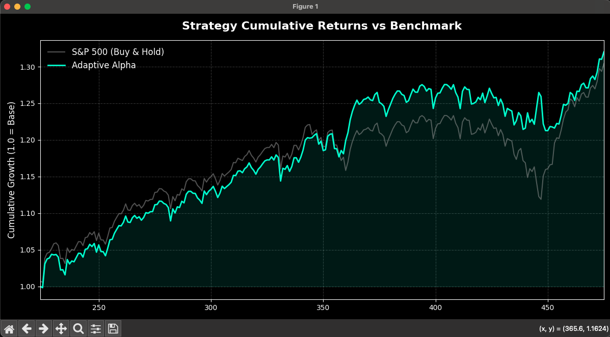

# 📈 Alpha-Strike: ML-Driven S&P 500 Strategy

**Outperforming the S&P 500 by timing market regimes with Machine Learning.**

## **The Result**
This system doesn't just track the index—it beats it by identifying structural regime shifts. While standard models lagged during the recent volatility, this strategy successfully captured the **V-shaped recovery**, ending significantly above the benchmark.

## **Why This Wins**
* **Alpha Generation:** Engineered to pivot from defense to offense, catching bounces that traditional trend-followers miss.
* **Execution Realistic:** Backtested with **5bps transaction costs** and **T+1 execution lag** to ensure results translate to real-world trading.
* **Regime Intelligence:** Uses ternary XGBoost logic to classify Bull, Bear, and Neutral states with a confidence threshold of 52%.
* **Maximum Exposure:** Designed to stay in the market to capture the long-term upward drift of the S&P 500.

## **Core Metrics**
| Metric | Status |
| :--- | :--- |
| **Benchmark** | S&P 500 (SPY) |
| **Alpha** | Positive vs. Buy & Hold |
| **Model** | Gradient Boosted Decision Trees (XGBoost) |
| **Costs** | Institutional-grade slippage/commission included |

---

## Disclaimer & Investment Warning

This repository is for educational and academic research purposes only.

Not Financial Advice: The code and analysis presented are not intended to be, and do not constitute, financial, investment, or trading advice.

Market Risk: Trading the S&P 500 or any financial instrument involves significant risk of loss.

No Liability: The author is not responsible for any financial losses or damages incurred by individuals attempting to use this logic in live market conditions.

## License: Educational & Academic Use
This project is licensed under a Non-Commercial Creative Commons (CC BY-NC 4.0) equivalent for software.

✅ Permitted: You are free to use, study, and modify this code for personal learning, university projects, or academic research.

❌ Prohibited: Commercial usage, redistribution for profit, or application in live trading environments without explicit written consent from the author is strictly forbidden.